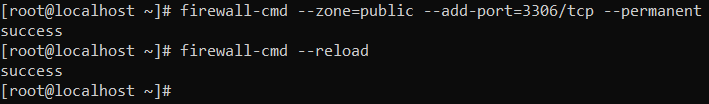
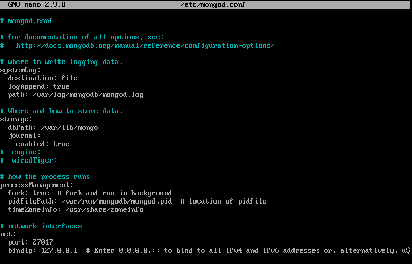

# INSTAL·LACIÓ MONGO DB

## INSTAL·LACIÓ

[OPCIONAL] És molt recomanable executar la següent comanda:

`yum update`

Crearem un fitxer per poder instal·lar el MongoDB amb el yum

`touch /etc/yum.repos.d/mongodb-org-5.0.repo`

Contingut del fitxer:
```
[mongodb-org-5.0]
name=MongoDB Repository
baseurl=https://repo.mongodb.org/yum/redhat/$releasever/mongodb-org/5.0/x86_64/
gpgcheck=1
enabled=1
gpgkey=https://www.mongodb.org/static/pgp/server-5.0.asc
```


A continuació instal·larem el MongoDB:

`sudo yum install -y mongodb-org`


## POSTINSTAL·LACIÓ

Ara executarem les següents comandes per aixecar el servei i comprovar l'estat de MongoDB:

`sudo systemctl start mongod`

`sudo systemctl status mongod`

Per verificar que el Mongo està correctament instal·lat ens ha d'aparèixer el missatge de "active (running)" com a la imatge


A continuació executarem la següent comanda per entrar a MongoDB:

`mongo`


[OPCIONAL] Ara configurarem una regla en el firewall per a connectar-nos al MongoDB des de fora:

`firewall-cmd --zone=public --add-port=3306/tcp --permanent`

`firewall-cmd --reload`



### FITXER DE CONFIGURACIÓ

El fitxer de configuració de MongoDB el trobarem a: `/etc/mongodb.conf`


