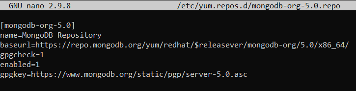
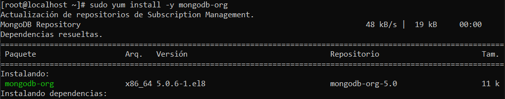
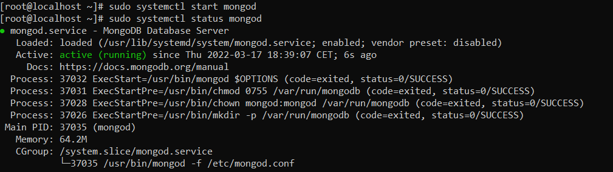
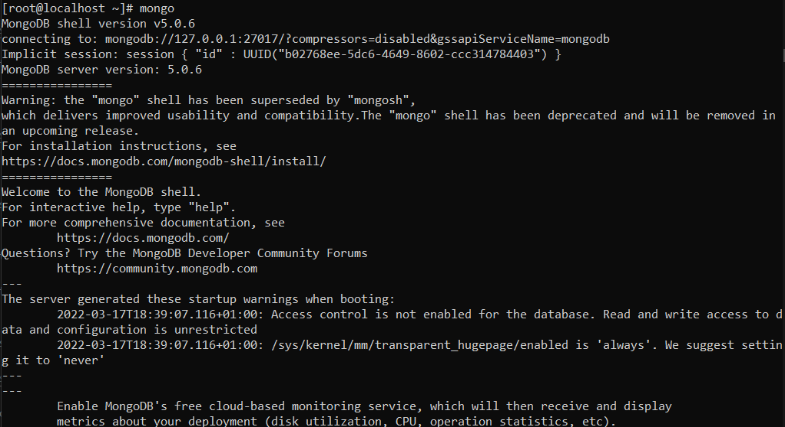
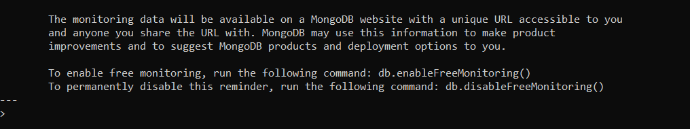

# INSTALACIÓ MONGO DB

## INSTALACIÓ

[OPCIONAL] Es molt recomenable executar la seguent comanda:

`yum update`

Crearem un fitxer per poder instalar el MongoDB amb el yum

`touch /etc/yum.repos.d/mongodb-org-5.0.repo`

Contingut del fitxer:
```
[mongodb-org-5.0]
name=MongoDB Repository
baseurl=https://repo.mongodb.org/yum/redhat/$releasever/mongodb-org/5.0/x86_64/
gpgcheck=1
enabled=1
gpgkey=https://www.mongodb.org/static/pgp/server-5.0.asc
```



A continuació instalarem el MongoDB:

`sudo yum install -y mongodb-org`



## POSTINSTALACIÓ

Ara executarem les seguents comandes per aixecar el servei i comprovar l'estat de Mongo:

`sudo systemctl start mongod`

`sudo systemctl status mongod`

Per verificar que el Mongo esta correctament instalat ens ha d'apareixer el missatge de "active (running)" com a la imatge



A continuació executarem la seguent comanda per entrar a Mongo:

`mongo`


