# INSTAL·LACIÓ MYSQL

## INSTAL·LACIÓ

[OPCIONAL] És molt recomanable executar la següent comanda:

`yum update`

Instal·larem el mysql:

`yum -y install @mysql`

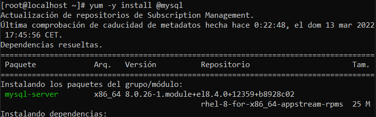

Ara aixecarem el servei de mysql i comprovarem l'estat:

`systemctl start mysqld`

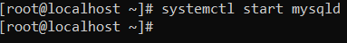

`systemctl enable --now mysqld`

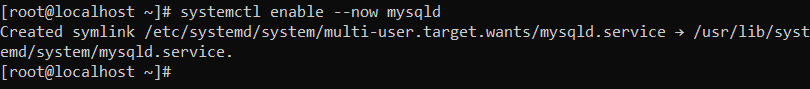

`systemctl status mysqld`

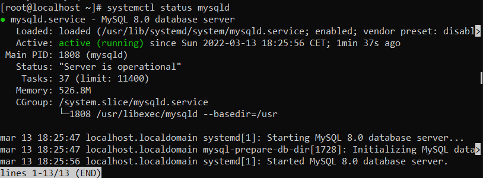

## POSTINSTAL·LACIÓ

Iniciarem sessio amb el root a mysql, la contrasenya per defecte de root esta buida:

`mysql -u root -p`

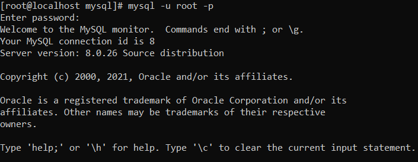

Per més seguretat li assignarem una contrasenya a root:

`ALTER USER "root"@"localhost" IDENTIFIED BY "[PASSWORD]"`

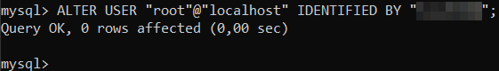

I crearem un usuari amb tots els permisos per a connectar-nos de forma remota i fer proves:

`CREATE USER "NOMUSUARI"@"[ LOCALHOST | % ]" IDENTIFIED BY "PASSWORD";`

`GRANT ALL PRIVILEGES ON *.* TO "NOMUSUARI"@"[ LOCALHOST | % ]]";`

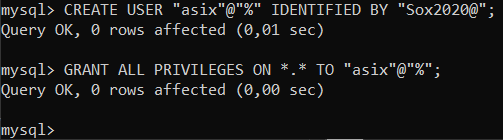

I crearem una regla al firewall per connectar-nos des de fora:

`firewall-cmd --zone=public --add-port=3306/tcp --permanent`

`firewall-cmd --reload`

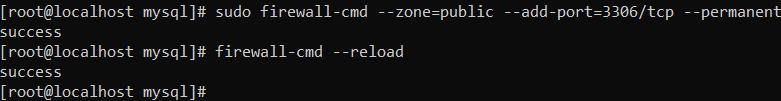

### FITXER DE CONFIGURACIÓ

`/etc/my.cnf`

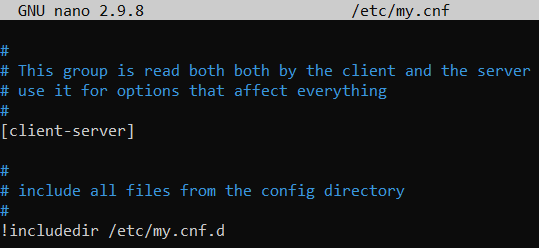

### CANVIAR EL PORT DE MYSQL

Per canviar el port del mysql anirem al fitxer de configuració i afegirem el següent.

`port=[port]`

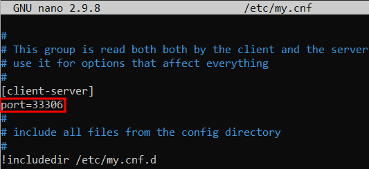

### ON GUARDA MYSQL ELS FITXERS DE DADES?

Anirem a la ruta `/etc/mysql.cnf.d` i entrarem al fitxer `mysql-server.cnf` i buscarem la línia que posa `datadir=[ruta]`

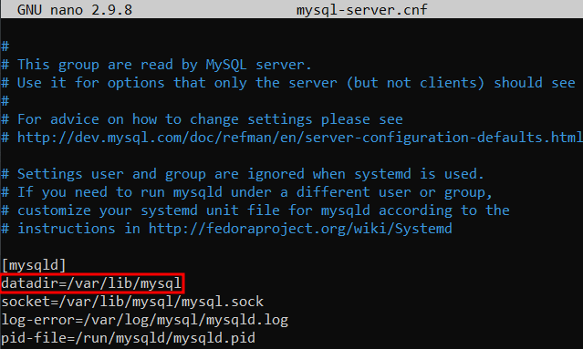

### RESULTAT COMANDA ps -ef | grep mysql

`ps -ef | grep mysql`

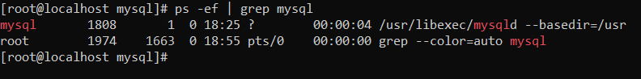
