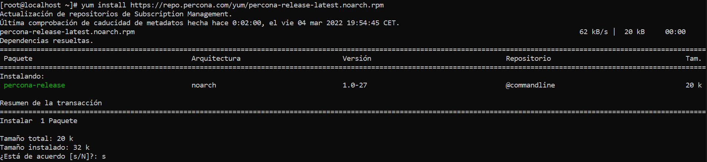
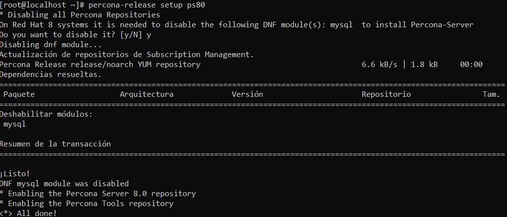
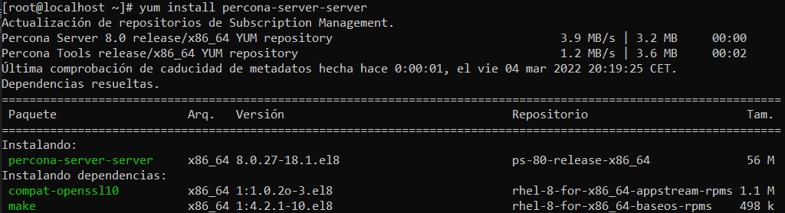
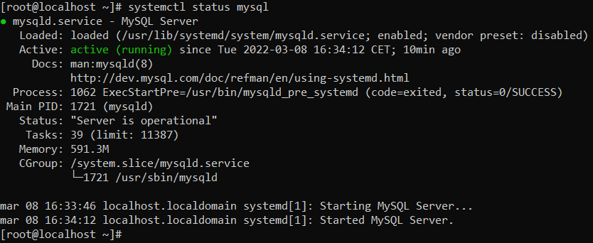
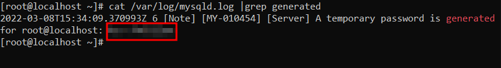

# INSTALACIÓ MYSQL PERCONA

## INSTALACIÓ

Instalarem el repositori de percona amb la seguent comanda:

`yum install https://repo.percona.com/yum/percona-release-latest.noarch.rpm`

Al executar la comanda anterior ens explica el que instalara i ens preguntara si estem d'acord amb la instalacio, li indiquem que si amb: "s"

Habilitarem el repositori:

`percona-release setup ps80`

Ens tornara a pregurtar si estem segurs li indiquem que si aquest cop amb: "y" com es veu a la imatge

I finalment instalem el percona

`yum install percona-server-server`

Ens fara varies perguntes i li contestarem "s" en tots els casos

## POSTINSTALACIÓ

Per comprovar que el mysql esta fucionant farem el seguent:

`systemctl status mysql`

I ens a d'apareixer el missatge "active (running)" com a la imatge

A continuació hem de mirar quina es la contraseña que s'ha generat de forma aleatoria per l'usuari Root:

`cat /var/log/mysqld.log |grep generated`

