# INSTALACIÓ PERCONA

## INSTALACIÓ

Instalarem el repositori de percona amb la seguent comanda:

`yum install https://repo.percona.com/yum/percona-release-latest.noarch.rpm`

Al executar la comanda anterior ens explica el que instalara i ens preguntara si estem d'acord amb la instalacio, li indiquem que si amb: "s"

Habilitarem el repositori:

`percona-release setup ps80`

Ens tornara a pregurtar si estem segurs li indiquem que si aquest cop amb: "y" com es veu a la imatge

I finalment instalem el percona

`yum install percona-server-server`

Ens fara varies perguntes i li contestarem "s" en tots els casos

## POSTINSTALACIÓ

Per comprovar l'estat del mysql farem el seguent:

`systemctl status mysql`

I ens a d'apareixer el missatge "active (running)" com a la imatge

Realitzarem la securització del percona per fer mes segura la base de dades:

`mysql_secure_installation`

El primer cop que introduim el password nou ens dona un error,(perque el percona ja porta un component instalat), i ens fara una pregunta, li contestarem: y
A continuació introduirem la nova contrasenya per a root (2 cops):

Ara ens preguntara si volem utilitzar la contrasenya que acabem d'introduir, i si volem eliminar els usuaris anonims, es recomenable dir que si per millorar la seguretat de la base de dades

A continuació ens pregunta si volem deshabilitar el login del root de forma remota, i si volem esborrar la base de dades de proves, es recomenable dir que si

Finalment ens preguntara si volem recarregar els permisos de les taules, es recomenable dir que si

Ara entrarem al mysql amb l'usuari Root i la contrasenya que hem canviat anteriorment:

`mysql -u root -p`

Per finalitzar les proves, ens connectarem al Percona desde el Workbench, per fer-ho haurem de realitzar els seguents passos:

Afegirem una regla al firewall per habilitar la conexio desde fora:

Crearem un usuari per accedir de forma remota:

[OPCIONAL] Canviarem els requisits de complexitat de la contrasenya per posar la que nosaltres volguem:

`SET GLOBAL validate_password.policy=LOW;`

`SET GLOBAL validate_password.length=6;`

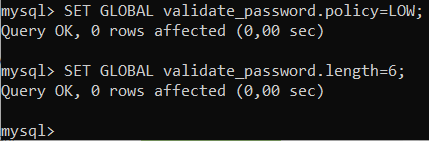

Crearem l'usuari:

`CREATE USER 'NOMUSUARI'@'[ LOCALHOST | % ]' IDENTIFIED BY 'PASSWORD';`

`GRANT ALL PRIVILEGES ON *.* TO 'NOMUSUARI'@'[ LOCALHOST | % ]]';`

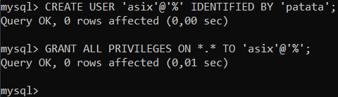

[OPCIONAL] A continuació configurarem l'usuari perque no hagi d'introduir el user i el password cada cop que entra en el client del percona:

Crearem l'arxiu `nano /home/[NOMUSUARI]/.my.cnf` i el modificarem com veiem a la imatge

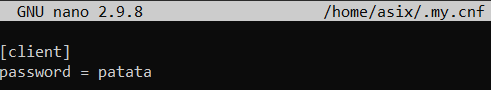

I finalment intentem connecternos al Percona desde el Workbench:

Crearem una connexio al Workbench:

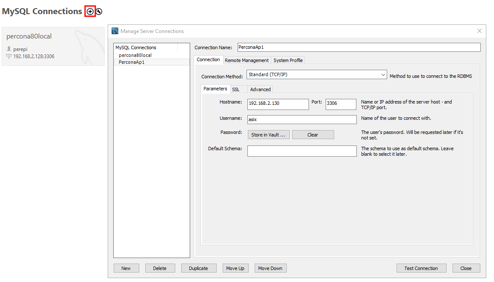

Introduirem la contrasenya:

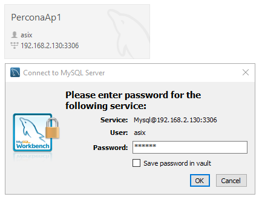

I ja ens podrem connectar al Percona de forma remota:

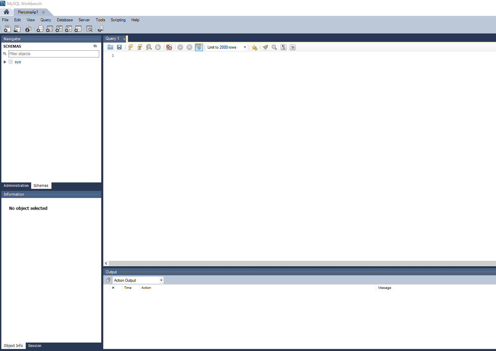

### COMANDES PER GESTIONAR EL SERVEI DE PERCONA

Apagar el servei de Percona:
`systemctl stop mysql`

Iniciar el servei de Percona:
`systemctl start mysql`

Veure l'estat del servei de Percona:
`systemctl status mysql`

### FITXER DE CONFIGURACIÓ

El fitxer de configuració de Percona es:
`/etc/my.cnf`

### CANVIAR EL PORT PEL QUE ESCOLTA

Per canviar el port per defecte anirem al arxiu `/etc/my.cnf` i afegirem la linia `port=[port]`

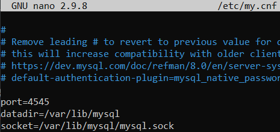

### CREAR USUARI AL SISTEMA IGUAL QUE EL DEL PERCONA

Primer canviarem els requisits de la contraseña del RedHat
Anirem al fitxer `/etc/security/pwquality.conf` i modificarem el seguent:

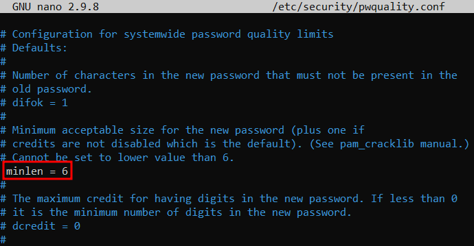

A continuació crearem l'usuari i li asignarem un password:

`useradd [NOMUSUARI]`

`passwd [NOMUSUARI]`

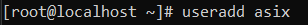
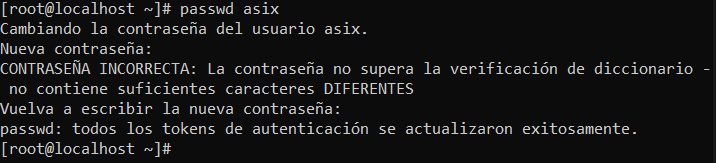

### ON GUARDA LES DADES EL PERCONA?

Per veure on guarda les dades haurem d'accedir al fitxer de configuració `/etc/my.cnf` i ens haurem de fixar en la ruta que indica despres de `datadir=[ruta]`

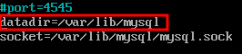
