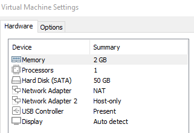
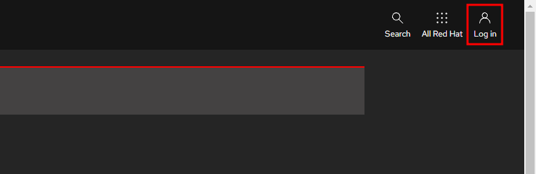
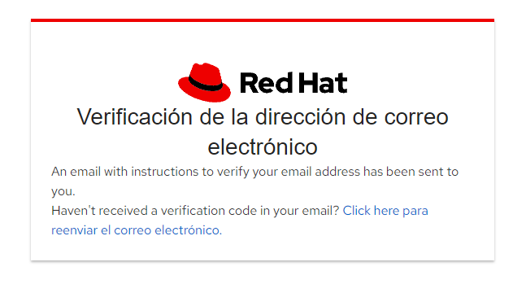
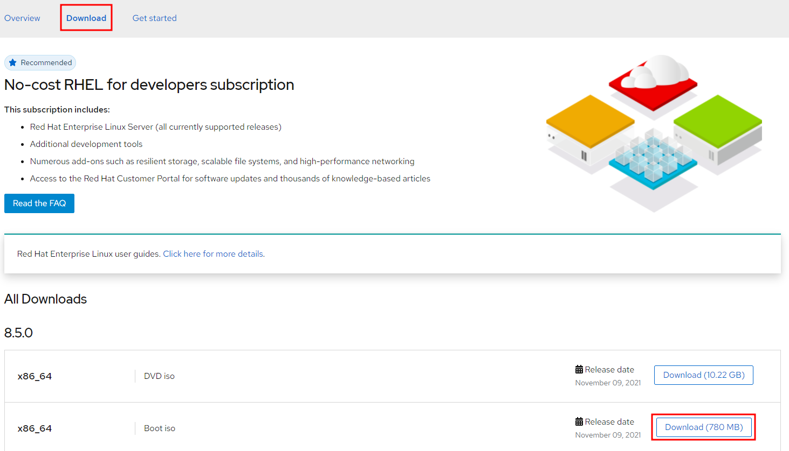
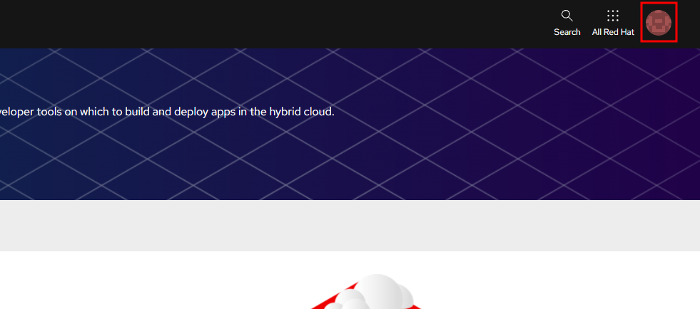
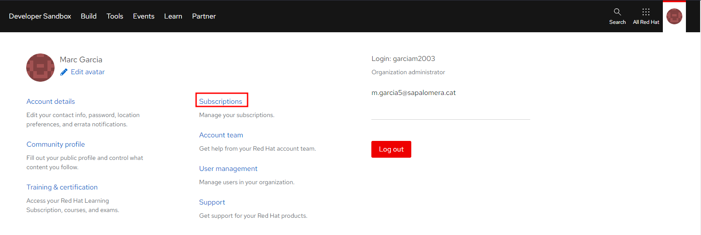
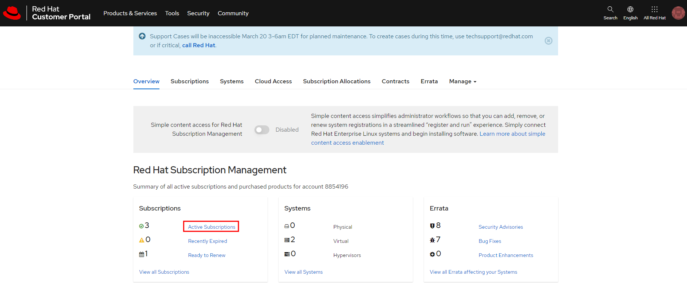
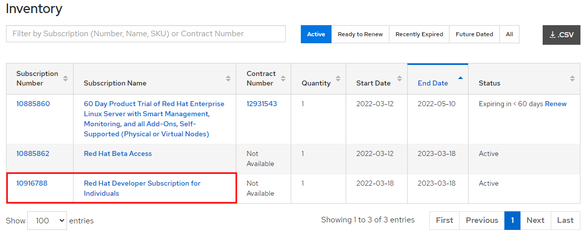

# Practica AP1

## Instal·lació Percona

## Instal·lació MySQL

## Instal·lació MongoDB

## HARDWARE i SOFTWARE
Per a realitzar aquesta pràctica he utilitzat una màquina virtual amb 1 core, 2 GB de RAM i 50 GB de disc dur.

I com a sistema operatiu he fet servir un RedHat 8.5

## CONFIGURACIÓ DE RED HAT

Per a poder treballar amb un sistema redhat i poder utilitzar els seus repositoris, ens haurem de registrar i configurar la màquina amb el compte que hem creat.

Per registrar-nos haurem d'accedir a aquest <a href="https://sso.redhat.com/auth/realms/redhat-external/protocol/openid-connect/auth?client_id=rhd-web&redirect_uri=https%3A%2F%2Fdevelopers.redhat.com%2Fproducts%2Frhel%2Fgetting-started%3Fsuccess%3Dtrue%26tcWhenSigned%3DJanuary%2B1%252C%2B1970%26tcWhenEnds%3DJanuary%2B1%252C%2B1970%26tcEndsIn%3D0%26tcDuration%3D365%26tcDownloadFileName%3Drhel-8.5-x86_64-boot.iso%26tcRedirect%3D5000%26tcSrcLink%3Dhttps%253A%252F%252Fdevelopers.redhat.com%252Fcontent-gateway%252Fcontent%252Forigin%252Ffiles%252Fsha256%252F61%252F61fe463758f6ee9b21c4d6698671980829ca4f747a066d556fa0e5eefc45382c%252Frhel-8.5-x86_64-boot.iso%26p%3DProduct%253A%2BRed%2BHat%2BEnterprise%2BLinux%26pv%3D8.5.0%26tcDownloadURL%3Dhttps%253A%252F%252Faccess.cdn.redhat.com%252Fcontent%252Forigin%252Ffiles%252Fsha256%252F61%252F61fe463758f6ee9b21c4d6698671980829ca4f747a066d556fa0e5eefc45382c%252Frhel-8.5-x86_64-boot.iso%253F_auth_%253D1647533589_813fe179a86ae89a9285e143dc2beadd&state=4e04cc97-2084-4c6a-a0db-3dc0b744d537&response_mode=fragment&response_type=code&scope=openid&nonce=54fb3d33-6bfb-4c5c-8acf-937e38994f6a"> link </a>

Un cop ens hàgem registrat haurem d'entrar al següent <a href="https://developers.redhat.com/">link</a> i farem click a login

Introduirem les nostres dades i ens demanarà que verifiquem el correu

Un cop hàgem verificat el correu, tornarem a la pàgina on estàvem, ara anirem a "Download" i ens descarregarem la ISO del redhat.

Ara farem click a l'icona del nostre perfil, i entrarem a l'apartat de "subscriptions"

A continuació anirem a l'apartat de "Active Subscriptions"

I ens ha d'aparèixer la subscripció "Red Hat Developer Subscription for Individuals"

Un cop tinguem instal·lat el redhat, executarem les següents comandes per a registrar la màquina amb el nostre usuari:

`subscription-manager register` (Ens demanarà usuari i password)

`subscription-manager refresh`

`subscription-manager attach --auto`
