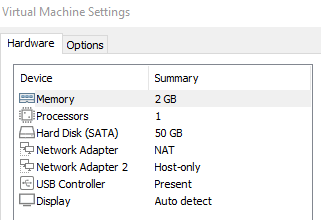

# Practica AP2

##  Configuració i comprovació de logs

## Realitzar connecxions segures sobre ssl

## HARDWARE i SOFTWARE
Per a realitzar aquesta pràctica he utilitzat una màquina virtual amb 1 core, 2 GB de RAM i 50 GB de disc dur.

I com a sistema operatiu he fet servir un RedHat 8.5

