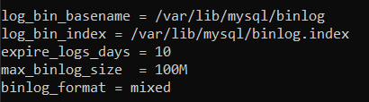

# TASQUES DE CONFIGURACIÓ I COMPROVACIÓ DE LOGS

## LOGS ACTIVATS PERDEFECTE

Per veure els logs que te el Percona per defecte entrarem al percona `mysql -u root -p` i executarem les seguents comandes:

### Pel log d'Errors:

Aquest log sempre ha d'estar activat (i ve activat per defecte) perque si el servei de percona falla i no inicia, en aquest log prodrem trovar l'error

### Pel log de Binary:

`SHOW VARIABLES LIKE '%log_bin%';`

I anirem a buscar les linies marcades a la imatge

### Pel log General:

`SHOW VARIABLES LIKE '%general%';`

### Pel log SlowQuery:

`SHOW VARIABLES LIKE '%slow_query%';`

Amb el Percona ve activat el log d'errors i log binary

## CREAR EL FITXER PER LA CONFIGURACIÓ DELS LOGS

Crearem el directori `percona-server`, i a continuació crearem el fitxer `logs.cnf`

Ara editarem el fitxer `nano logs.cnf` i afegirem el seguent codi

### Pel log de Binary:

Indicarem la ruta del log

`log_bin_basename = /var/lib/mysql/binlog`

Indicarem la ruta del index

`log_bin_index = /var/lib/mysql/binlog.index`

Posem limit de dies que volem que guardi log

`expire_logs_days = 10`

Posem limit a la mida del fitxer de log

`max_binlog_size  = 100M`

Posem el format en el que volem que guardi el log [statement | row | mixed]

`binlog_format = mixed`

### Pel log General

Ara posarem 1 en cas de voler activar el log, i 0 en cas de voler desactivar

`general_log = 1`

Indicarem la ruta del logs

`general_log_file = /var/lib/mysql/general.log`

### Pel log SlowQuery

Ara posarem 1 en cas de voler activar el log, i 0 en cas de voler desactivar

`slow_query_log = 1`

Indicarem la ruta del log

`slow-query_log_file = /var/lib/mysql/localhost-slow.log`

Indicarem a partir de cuants segons guardará la sentencia en el log

`long_query_time = 2`

### MODIFICAR EL FITXER my.cnf

Ara anirem al fitxer `my.cnf` i afegirem el seguent, per cuan el servei de Percona arranqui apliqui la configuració del fitxer `logs.cnf`

`!includedir /etc/percona-server`

