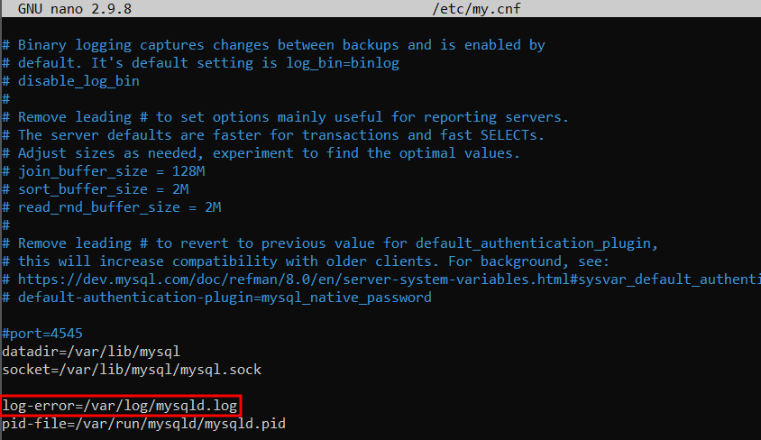

# TASQUES DE CONFIGURACIÓ I COMPROVACIÓ DE LOGS

## LOGS ACTIVATS PERDEFECTE

Per veure els logs que te el Percona per defecte anirem al fitxer de configuració `/etc/my.cnf`

Amb el Percona ve activat el log d'errors

## CREAR EL FITXER logs.cnf PER LA CONFIGURACIÓ DELS LOGS

Crearem el directori `percona-server`, i a continuació crearem el fitxer `logs.cnf`

