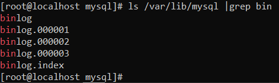

# TASQUES DE CONFIGURACIÓ I COMPROVACIÓ DE LOGS

## LOGS ACTIVATS PER DEFECTE

Per veure els logs que té el Percona per defecte entrarem al percona `mysql -u root -p` i executarem les següents comandes:

### Pel log d'Errors:

Aquest log sempre ha d'estar activat (i ve activat per defecte) perquè si el servei de percona falla i no inicia, en aquest log podrem trobar l'error

### Pel log de Binary:

`SHOW VARIABLES LIKE '%log_bin%';`

I anirem a buscar les línies marcades a la imatge


### Pel log General:

`SHOW VARIABLES LIKE '%general%';`


### Pel log SlowQuery:

`SHOW VARIABLES LIKE '%slow_query%';`


Amb el Percona ve activat el log d'errors i log binary

## CREAR EL FITXER PER LA CONFIGURACIÓ DELS LOGS

Crearem el directori `percona-server`, i a continuació crearem el fitxer `logs.cnf`


Ara editarem el fitxer `nano logs.cnf` i afegirem el següent codi

`[mysqld]`


### Pel log General

Ara posarem 1 en cas de voler activar el log, i 0 en cas de voler desactivar

`general_log = 1`

Indicarem la ruta del logs

`general_log_file = /var/lib/mysql/general.log`


### Pel log SlowQuery

Ara posarem 1 en cas de voler activar el log, i 0 en cas de voler desactivar

`slow_query_log = 1`

Indicarem la ruta del log

`slow-query_log_file = /var/lib/mysql/localhost-slow.log`

Indicarem a partir de quants segons guardarà la sentència en el log

`long_query_time = 2`


### MODIFICAR EL FITXER my.cnf

Ara anirem al fitxer `my.cnf` i afegirem el seguent, per quan el servei de Percona arranqui apliqui la configuració del fitxer `logs.cnf`

`!includedir /etc/percona-server`


## COMPROVAR QUE ELS CANVIS QUE HEM FET FUNCIONAN

Igual que en primer pas mirarem les variables per verificar que els canvis que hem fet han funcionat haurem de reiniciar el servei de mysql amb la comanda `systemctl status mysqld`

### Pel log General

`SHOW VARIABLES LIKE '%general%';`


### Pel log SlowQuery

`SHOW VARIABLES LIKE '%slow_query%';`


## DESACTIVAR ELS LOGS ACTIVATS ANTERIORMENT

Per desactivar els log que hem activat simplement haurem d'anar al fitxer `logs.cnf` i modificar els seguent

### GENERAL LOG

~~`general_log = 1`~~

`general_log = 0`


### SLOWQUERY LOG

~~`slow_query_log = 1`~~

`slow_query_log = 0`


Un cop haguem modificat el codi, haurem de reiniciar el servei de mysql perquè funcioni amb la comanda `systemctl restart mysqld`

## ACTIVAR ELS LOGS EN TEMPS D'EXECUCIÓ

Entrarem al mysql i executarem el següent:

### Pel log SlowQuery

`SET GLOBAL slow_query_log = 1`


### Pel log General

`SET GLOBAL general_log = 1;`


Ara canviarem el destí del log d'un fitxer per una taula

`SET GLOBAL log_output = "TABLE";`


Per veure aquesta taula executarem la següent comanda:

`SELECT * FROM mysql.general_log;`


## CARREGAR LA BD Sakila PER FER PROVES

Descarregarem l'arxiu <a href="https://downloads.mysql.com/docs/sakila-db.tar.gz">aquí</a> (També està en aquest mateix git)

Localitzarem on està l'arxiu, en el meu cas: `C:\Users\Marc\Downloads\sakila-db.tar.gz`

I a continuació executarem la comanda `spc` per transferir l'arxiu de forma segura

`scp -r <ruta maquina local> <usuari maquina desti>@<ip maquina desti>:<ruta maquina desti>`


Ara ens situarem en la carpeta on hàgem enviat l'arxiu i descomprimirem l'arxiu

`tar -xzvf sakila-db.tar.gz`

I ens crearà una carpeta amb els arxius que necessitem


A continuació anirem al Percona i importarem la BBDD

`mysql -u <usuari> -p`

I executarem el següent sentència:

`SOURCE <ruta dels fitxers descomprimits>/sakila-schema.sql;`


## COMPTAR EL NÚMERO DE CREATE TABLES DINS DEL GENRAL LOG

Per comptar el número de CREATE TABLES que hi ha en la taula del general log ho farem amb la següent sentència:

```SELECT COUNT(CONVERT(CAST(CONVERT(argument USING latin1) AS BINARY) USING utf8)) AS argument FROM mysql.general_log WHERE argument LIKE '%CREATE TABLE%';```


## COMPROVAR EL SLOW QUERY LOG

Per comprovar que l'Slow Query Log funciona farem el següent

Executarem una sentència amb el paràmetre `SLEEP(<segons>)`:

`SELECT SLEEP(5);`


Ara anirem el log i comprovarem que ha registrat aquesta sentència

`cat <ruta del log>`


[OPCIONAL] Si no apareix la sentència que hem executat, provarem el seguent:

Anirem al Percona i posarem el 'log_output' en mode FILE, ja que aquest paràmetre no només afecta al general log

`SET GLOBAL log_output = "FILE";`

I tornarem a comprovar

## COMPROVAR EL BINARY LOG

Primer comprovarem que tenim el log activat

`SHOW VARIABLES LIKE '%log_bin%';`


A continuació esborrarem tots els logs amb la sentència RESET MASTER

`RESET MASTER;`


Ara crearem i esborrarem una base de dades:

`CREATE DATABASE foo;`

`DROP DATABASE foo;`


A continuació comprovarem les sentències que hem executat en quin log estan

`SHOW BINLOG EVENTS;`


Com veiem en l'imatge anterior tenim les sentències en el binlog 1

Ara forçarem el mysql per que utilitzi nous arxius logs amb la sentència FLUSH LOGS

Si fem `FLUSH LOGS;` ens canviará coses de varios logs, i nosaltres estem fent proves amb el Binary Log, per tant farem el seguent

`FLUSH BINARY LOGS;`


Tornem a crear i esborrar una base de dades

`CREATE DATABASE bar;`

`DROP DATABASE bar;`


Per veure tots els log que hi han, farem el seguent

`ls /var/lib/mysql |grep bin`



Ara revisarem el segon binlog (amb la comanda anterior hem vist que es el 000002) amb la sentència:

`SHOW BINLOG EVENTS IN 'binlog.000002';`


A continuació esborrarem el primer binlog, amb la següent comanda:

`rm /var/lib/mysql/binlog.000001`


Per visualitzar el log ho farem amb l'eina mysqlbinlog, amb la següent comanda:

`mysqlbinlog binlog.0000002`


Per identificar el número d'event de la sentència `CREATE DATABASE` ens fixarem en una línia anterior a la de `CREATE DATABASE` que comença per `# at ...` i el número que apareix es el número d'event


## DESACTIVAR BINARY LOG NOMES EN UNA SESSIÓ

Per desactivar el binary log només en una sessió haurem d'executar la següent sentència:

`SET sql_log_bin = OFF;`


