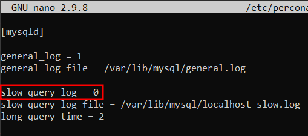

# TASQUES DE CONFIGURACIÓ I COMPROVACIÓ DE LOGS

## LOGS ACTIVATS PERDEFECTE

Per veure els logs que te el Percona per defecte entrarem al percona `mysql -u root -p` i executarem les seguents comandes:

### Pel log d'Errors:

Aquest log sempre ha d'estar activat (i ve activat per defecte) perque si el servei de percona falla i no inicia, en aquest log prodrem trovar l'error

### Pel log de Binary:

`SHOW VARIABLES LIKE '%log_bin%';`

I anirem a buscar les linies marcades a la imatge

### Pel log General:

`SHOW VARIABLES LIKE '%general%';`

### Pel log SlowQuery:

`SHOW VARIABLES LIKE '%slow_query%';`

Amb el Percona ve activat el log d'errors i log binary

## CREAR EL FITXER PER LA CONFIGURACIÓ DELS LOGS

Crearem el directori `percona-server`, i a continuació crearem el fitxer `logs.cnf`

Ara editarem el fitxer `nano logs.cnf` i afegirem el seguent codi

`[mysqld]`

### Pel log General

Ara posarem 1 en cas de voler activar el log, i 0 en cas de voler desactivar

`general_log = 1`

Indicarem la ruta del logs

`general_log_file = /var/lib/mysql/general.log`

### Pel log SlowQuery

Ara posarem 1 en cas de voler activar el log, i 0 en cas de voler desactivar

`slow_query_log = 1`

Indicarem la ruta del log

`slow-query_log_file = /var/lib/mysql/localhost-slow.log`

Indicarem a partir de cuants segons guardará la sentencia en el log

`long_query_time = 2`

### MODIFICAR EL FITXER my.cnf

Ara anirem al fitxer `my.cnf` i afegirem el seguent, per cuan el servei de Percona arranqui apliqui la configuració del fitxer `logs.cnf`

`!includedir /etc/percona-server`

## COMPROVAR QUE ELS CANVIS QUE HEM FET FUNCIONAN

Igual que en primer pas mirarem les variables per verificar que els canvis que hem fet han funcionat haurem de reiniciar el servei de mysql amb la comanda `systemctl status mysqld`

### Pel log General

`SHOW VARIABLES LIKE '%general%';`

### Pel log SlowQuery

`SHOW VARIABLES LIKE '%slow_query%';`

## DESACTIVAR ELS LOGS ACTIVATS ANTERIORMENT

Per desactivar els log que hem activat simplement haurem d'anar al fitxer `logs.cnf` i modificar els seguent

### GENERAL LOG

~~`general_log = 1`~~

`general_log = 0`

### SLOWQUERY LOG

~~`slow_query_log = 1`~~

`slow_query_log = 0`

Un cop hàgem modificat el codi, haurem de reiniciar el servei de mysql per que funcioni amb la comanda `systemctl restart mysqld`

## ACTIVAR ELS LOGS EN TEMPS D'EXECUCIÓ

Entrarem al mysql i executarem el seguent:

### Pel log SlowQuery

`SET GLOBAL slow_query_log = 1`

### Pel log General

`SET GLOBAL general_log = 1`

Ara canviarem el desti del log de un fitxer per una taula

Per veure aquesta taula executarem la seguent comanda:

`SELECT * FROM mysql.general_log;`

## CARREGAR LA BD Sakila PER FER PROVES

Descarregarem l'arxiu <a href="https://downloads.mysql.com/docs/sakila-db.tar.gz">aqui</a>

Localitzarem on esta l'archiu, en el meu cas: `C:\Users\Marc\Downloads\sakila-db.tar.gz`

I a continuacio executarem la comanda `spc` per transferir l'arxiu de forma segura

`scp -r <ruta maquina local> <usuari maquina desti>@<ip maquina desti>:<ruta maquina desti>`

Ara ens situarem en la carpeta on haguem enviat el arxiu i descomprimirem el arxiu

`tar -xzvf sakila-db.tar.gz`

I ens creará una carpeta amb els arxius que necesitem

A continuació anirem al Percona i importarem la BBDD

`mysql -u <usuari> -p`

I executarem el seguent sentencia:

`SOURCE <ruta dels fitxers descomprimits>/sakila-schema.sql;`

