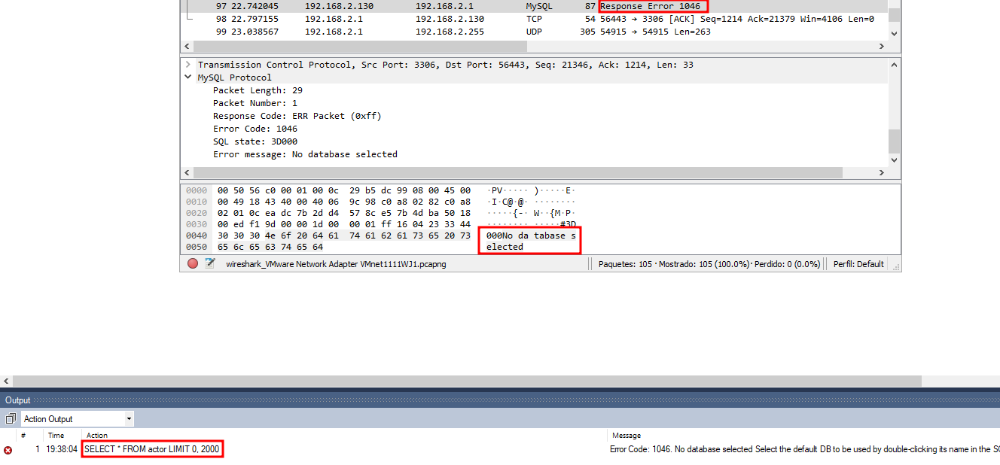
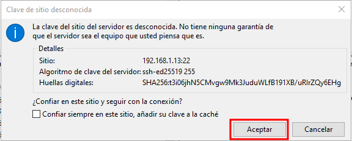
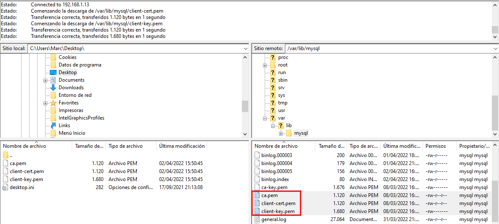
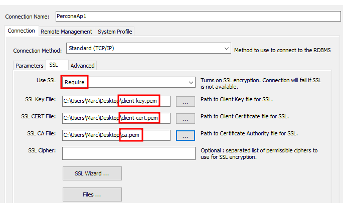
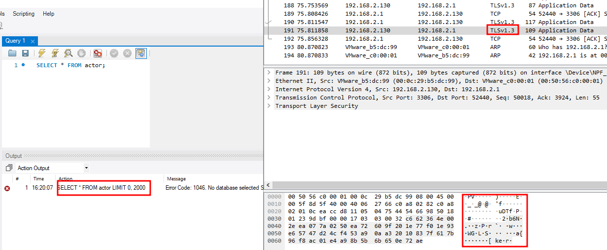

# CONFIGURACIÓ DEL SERVIDOR PERCONA SERVER PER REALITZAR CONNEXIONS SEGURES SOBRE SSL

## COMPROVAR AMB EL WIRESHARK SI AMB UNA CONNEXIÓ NO SEGURA PODEM CAPTURAR LA SENTÈNCIA ENVIADA DES DE EL WORKBENCH

Primer comprovarem que podem interceptar dades si realitzem una connexió no segura, ens connectarem des del Workbench modificant la configuració per defecte

A continuació amb el Wireshark intentarem capturar una consulta i la resposta del mysql

Primer seleccionarem la interfície a la que estem connectats a la màquina

Un cop ens connectem al servidor des del Workbench, el Wireshark començarà a trobar paquets amb el protocol MySQL i en l'apartat info ens haurem de fixar quan posi "Request Query" o "Response..." com a la imatge

Aquests paquets els anirem obrint i en l'apartat d'abaix del Wireshark hauríem de veure la sentència que hem executat des del Workbench, com les següents imatges

CONSULTA

RESPOSTA

## CONFIGURACIÓ DEL SSL AL WORKBENCH

Ens connectarem al servidor amb el FileZilla al servidor Percona

Al connectar-nos per primer cop ens preguntarà si confiem en el server, marcarem Aceptar

La ruta on estan situats els certificats es `/var/lib/mysql`

I seleccionarem els següents certificats:

`ca.pem`

`client-cert.pem`

`client-key.pem`

I els passarem (per exemple) a l'escriptori

Ara anirem al Workbench, editarem la connexió cap al Percona i anirem a l'apartat de configuració de SSL

En l'apartat de Use SSL marcarem Require, per activar la connexió segura

I en els altres apartats anirem afegint els arxius adequats, tal com veiem en la imatge

## COMPROVAR QUE AMB L'ENCRYPTACIO NO PODEM CAPTURAR LA INFORMACIÓ

Un cop hem configurat l'SSL comprovarem que ara no podem veure la sentència que enviem des del Workbench

Anirem al WireShark i començarem a capturar paquets, seguidament ens connectarem des del Workbench al Percona i executarem una sentència

A l'intentar capturar la sentència, ens trobarem que ara en l'apartat de protocol ja no apareix MySQL, ara apareix TLSv1.3 i no podem veure la sentència, com es veu a l'imatge

