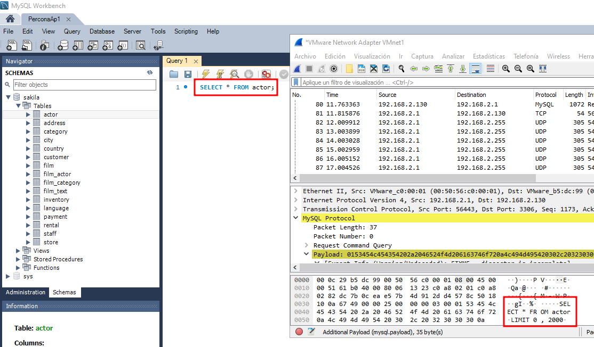
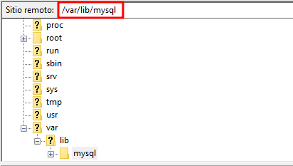

# CONFIGURACIÓ DEL SERVIDOR PERCONA SERVER PER REALITZAR CONNEXIONS SEGURES SOBRE SSL

## COMPROVAR AMB EL WIRESHARK SI AMB UNA CONNEXIO NO SEGURA PODEM CAPTURAR LA SENTENCIA ENVIADA DESDE EL WORKBENCH

Primer comprovarem que podem interceptar dades si realitzem una connexió no segura, ens connectarem desde el Workbench modificant la configuració per defecte

A continuació amb el Wireshark intentarem capturar una consulta i la resposta del mysql

Primer seleccionarem la interficie a la que estem connectats a la maquina

Un cop ens connectem al servidor desde el Workbench, el Wireshark començara a trovar paquets amb el protocol MySQL i en l'apartat info ens haurem de fixar cuan posi "Request Query" o "Response..." com a la imatge

Aquests paquets els anirem obrin i en l'apartat d'abaix del Wireshark hauriem de veure la sentecia que hem executat desde el Workbench, com les seguents imatges

CONSULTA

RESPOSTA

## CONFIGURACIÓ DEL SSL AL WORKBENCH

Ens connectarem al servidor amb el FileZilla al servidor Percona

Al connectar-nos per primer cop ens preguntara si confiem en el server, marcarem Aceptar

La ruta on estan situats els certificats es `/var/lib/mysql`

I seleccionarem els seguents certificats:

`ca.pem`

`client-cert.pem`

`client-key.pem`

I els pasarem (per exemple) a l'escriptori

Ara anirem al Workbench, editarem la connexio cap al Percona i anirem a l'apartat de configuració de SSL

En l'apartat de Use SSL marcarem Require, per activar la connexio segura

I en els demes apartats anirem afegin els arxius adecuats, tal i com veiem en la imatge

## COMPROVAR QUE AMB L'ENCRYPTACIO NO PODEM CAPTURAR LA INFORMACIÓ

Un cop hem configurat l'SSL comprovarem que ara no podem veure la sentencia que enviem des del Workbench

Anirem al WireShark i començarem a capturar paquets, seguidament ens connectarem desde el Workbench al Percona i executarem una sentencia

Al intentar capturar la sentencia, ens trobarem que ara en l'apartat de protocol ja no apareix MySQL, ara apareix TLSv1.3 i no podem veure la sentencia, com es veu a l'imatge

