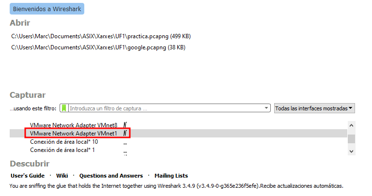

# CONFIGURACIÓ DEL SERVIDOR PERCONA SERVER PER REALITZAR CONNEXIONS SEGURES SOBRE SSL

Primer comprovarem que podem interceptar dades si realitzem una connexió no segura, ens connectarem desde el Workbench modificant la configuració per defecte

A continuació amb el Wireshark intentarem capturar una consulta i la resposta del mysql

Primer seleccionarem la interficie a la que estem connectats a la maquina

Un cop ens connectem al servidor desde el Workbench, el Wireshark començara a trovar paquets amb el protocol MySQL i en l'apartat info ens haurem de fixar cuan posi "Request Query" o "Response..." com a la imatge

Aquests paquets els anirem obrin i en l'apartat d'abaix del Wireshark hauriem de veure la sentecia que hem executat desde el Workbench, com les seguents imatges

CONSULTA

RESPOSTA

