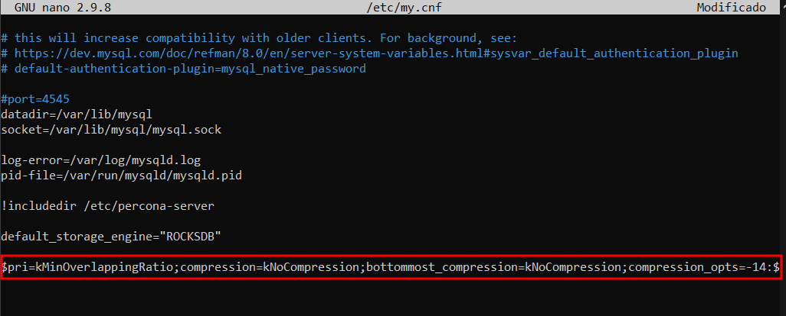
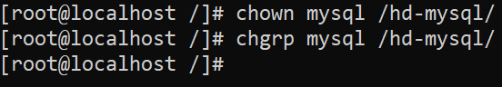
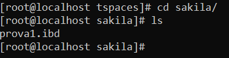
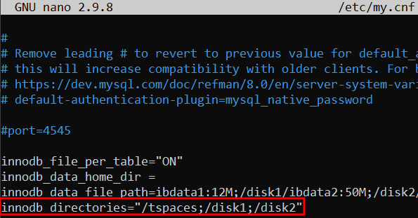

# STORAGE ENGINE

## STORAGE ENGINES QUE PODEM UTILITZAR I MODIFICAR EL MOTOR DEFAULT

Per veure els motors d'emmagatzematge que podem utilitzar, executarem la seguent sentencia

`SHOW ENGINES;`

Per veure quins motors podem utilitzar ens fixarem en l'apartat support en la captura, tot el que posi "YES" vol dir que el prodrem utilitzar


Amb la comanda anterior també podem saber quine el el Storage Engine per defecte

En el cas de Percona el Storage Engine per defecte es: "InnoDB"


Per canviar el motor per defecte ho podrem fer de 2 maneres:

* ### TEMPORAL

Executarem la seguent sentencia

`SET default_storage_engine="<NOM_MOTOR>"`


Per verificar que ha funcionat tornarem a executar `SHOW ENGINES;`


* ### PERMANENT

Anirem al my.cnf i afegirem el parametre `default_storage_engine`

`default_storage_engine="<NOM_MOTOR>"`


I reiniciarem el servei de Percona

`systemctl restart mysqld`


Per verificar que ha funcionat entrarem al mysql i tornarem a executar `SHOW ENGINES;`


## INSTALAR I ACTIVAR MyRocks

Per instalar MyRocks executarem la seguent comanda

`sudo yum install percona-server-rocksdb -y`


Per activar MyRocks executarem la seguent comanda

`ps-admin --enable-rocksdb -u root -p<PswUsuari>`


Posarem MyRocks com a motor per defecte


Finalment reiniciarem el servei de Percona i comprovarem que tot ha funcionat

`systemctl restart mysqld`


`SHOW ENGINES;`


## COM UTILITZAR EL STORAGE ENGINE CSV

Crearem una base de dades per proves

`CREATE DATABASE <NomDB>`


I una taula amb camps NOT NULL, ja que el motor CSV no suporta camps Nulls

`CREATE TABLE <NomTaula> (<camp1> <parametre1>... NOT NULL, <camp2> <parametre1>... NOT NULL)`


Introduirem dades en la taula

`INSERT INTO <NomTaula> VALUES(<camp1>,'<camp2>'),(<camp1>,'<camp2>');`


I mirarem la taula

`SELECT * FROM <NomTaula>;`


Ara anirem a buscar l'arxiu CSV i l'obrirem

L'arxiu CSV esta situat a la seguent ruta: `/var/lib/mysql/<NomDB>/<NomTaula>.CSV`


## STORAGE ENGINE MyRocks

Al final del primer apartat posem el MyRocks per defecte, si no ho fem els seguents pasos no funcionaran

Ara en la Base de dades que hem creat anteriorment afegirem 3 taule i afegirem dades a les 3 taules

`USE <NomDB>`

`CREATE TABLE <NomTaula> (<camp1> <parametre1>..., ...)`


`INSERT INTO <NomTaula> VALUES(<camp1>,'<camp2>'),...;`


Ara anirem a buscar els fitxers de dades

`cd /var/lib/mysql/<NomDB>`

`du -sh *`

El numero de l'esquerre son els Kb que pesen els arxius


Per veure la compressio per defecte, executarem la seguent sentencia

`SELECT * FROM information_schema.rocksdb_cf_options WHERE option_type LIKE '%ompression%' AND cf_name='default';`


Per deshabilitar la compresio dels fitxers de les taules, anirem al fitxer `my.cnf`, i afegirem el seguent

```
rocksdb_default_cf_options="write_buffer_size=256m;target_file_size_base=32m;max_bytes_for_level_base=512m;max_write_buffer_number=4;level0_file_num_compaction_trigger=4;level0_slowdown_writes_trigger=20;level0_stop_writes_trigger=30;max_write_buffer_number=4;block_based_table_factory={cache_index_and_filter_blocks=1;filter_policy=bloomfilter:10:false;whole_key_filtering=0};level_compaction_dynamic_level_bytes=true;optimize_filters_for_hits=true;memtable_prefix_bloom_size_ratio=0.05;prefix_extractor=capped:12;compaction_pri=kMinOverlappingRatio;compression=kLZ4Compression;bottommost_compression=kLZ4Compression;compression_opts=-14:4:0"
```



[OPCIONAL] Si volem cambiar a la compressio Zlib, anirem al fitxer `my.cnf`, i afegirem el seguent

```
rocksdb_default_cf_options="write_buffer_size=256m;target_file_size_base=32m;max_bytes_for_level_base=512m;max_write_buffer_number=4;level0_file_num_compaction_trigger=4;level0_slowdown_writes_trigger=20;level0_stop_writes_trigger=30;max_write_buffer_number=4;block_based_table_factory={cache_index_and_filter_blocks=1;filter_policy=bloomfilter:10:false;whole_key_filtering=0};level_compaction_dynamic_level_bytes=true;optimize_filters_for_hits=true;memtable_prefix_bloom_size_ratio=0.05;prefix_extractor=capped:12;compaction_pri=kMinOverlappingRatio;compression=kZlibCompression;bottommost_compression=kZlibCompression;compression_opts=-14:4:0"
```

I reiniciarem el servei de Percona

`systemctl restart mysqld`


I per comprovar que aixo ha funcionat, tornarem a mirar el tipus de compressio estem utilitzant

`SELECT * FROM information_schema.rocksdb_cf_options WHERE option_type LIKE '%ompression%' AND cf_name='default';`


## INNODB

### Desactivar l'opció que ve per defecte de innodb_file_per_table

Anirem al my.cnf i afegirem el seguent:

`innodb_file_per_table="OFF"`


Guardem els canvis i reiniciarem el servei de mysql

`systemctl restart mysqld`


Entrarem al Mysql i executarem el seguent, per verificar que el que hem fet funciona:

`SHOW VARIABLES LIKE '%file_per_table%';`


### Permisos directori /datadir

Per veure el PATH del datadir anirem a l'arxiu /etc/my.cnf, i buscarem el parametre "datadir"


Per veure els permisos del directori datadir executarem el seguent

`ls <PATH>/.. -asil | grep mysql`


### Veure la mida perdefecte del tablespace de sistema

Anirem al mysql i executarem la seguent sentencia

`SHOW VARIABLES LIKE '%innodb_data%';`


### Importar la BD Sakila com a taules InnoDB

Descarregarem l'arxiu <a href="https://downloads.mysql.com/docs/sakila-db.tar.gz">aquí</a> (També està en aquest mateix git)

Localitzarem on està l'arxiu, en el meu cas: `C:\Users\Marc\Downloads\sakila-db.tar.gz`

I a continuació executarem la comanda `spc` per transferir l'arxiu de forma segura

`scp -r <ruta maquina local> <usuari maquina desti>@<ip maquina desti>:<ruta maquina desti>`


Ara ens situarem en la carpeta on hàgem enviat l'arxiu i descomprimirem l'arxiu

`tar -xzvf sakila-db.tar.gz`

I ens crearà una carpeta amb els arxius que necessitem


Ara ens situarem a la carpeta que s'ens ha generat

`cd sakila-db`

I obrirem l'archiu sakila-schema.sql

`nano sakila-schema.sql`´

Un cop dins de l'archiu farem Ctrl + W, per buscar


Ara baixarem fins on esta l'estructura de la taula que hem buscat, i afegirem el seguent

`ENGINE=InnoDB`


Guardem, i sortim

A continuació anirem al Percona i importarem la BBDD

`mysql -u <usuari> -p`

I executarem el següent sentència:

`SOURCE <ruta dels fitxers descomprimits>/sakila-schema.sql;`


### On s'han guardat els fitxers de dades?

Anirem a `/var/lib/mysql` per veure com s'han guardat les dades


Entrarem a la carpeta de Sakila i mirarem que conte


La carpeta sakila no conté res, per tant aixo vol dir que les dades estan guardades a l'archiu ibdata1, si mirem el que pesa aquest archiu veurem que pesa mes que el que pesa perdefecte (12M)


## Cambiar la configuració del mysql

### Canviar la localització del directori de dades a /hd-mysql

Primer crearem la carpeta i posarem els permisos que tocan





Ara anirem a `my.cnf` i modificarem el parametre DataDir, per la carpeta que hem creat


I reiniciem el servei


Ara mirem la carpeta i ens ha generat el seguent


Finalment canviarem el socket, anirem al `my.cnf`, i modificarem el paramentre


I reiniciem el servei


Ara mirem la carpeta i ens ha generat el fitxer `mysql.sock`


Si intentem entrar al MySQL, tindrem 2 problemas:

Primer al cambiar el datadir hem perdut el password del root, i s'ens ha generat una de nova, per veure-la executarem el seguent:

`cat /var/log/mysqld.log | grep generated`

Si apareixen mes d'una agafarem la mes recent


Ara un cop tenim el password correcte, tampoc podem accedir a mysql


Per solucionar aixo anirem al `my.cnf` i afegirem el seguent

```
[client]

socket=<PATH-NOU-SOCKET>
```


Per seguretat haurem de canviar la contrasenya


### Tenir 2 fitxers corresponents al Tablesace de sistema

Apagarem la maquina, i afegirem 2 discos a la maquina (un per fitxer)


Tornarem a encendre la maquina, i muntarem els discos

Executarem el seguent, i buscarem els discos de 10Gb

`fdisk -l`


Un cop tenim els discos identificats, el fortmatarem

`mkfs -t <format> <dispositiu>`


Ara muntarem els discos en el `/etc/fstab`


I reiniciarem la maquina

`init 6`

Ara canviarem el propietari i grup de `/disk1` i `/disk2`

`chown mysql <PATH>`


A continuació anirem al my.cnf i modificarem el seguent

`innodb_data_file_path=ibdata1:12M;/disk1/ibdata2:50M;/disk2/ibdata3:50M:autoextend`

I per fer que els fitxers creixin, afegirem el seguent parametre:

`innodb-autoextend-increment=5`


### GERNERAR TABLESPACE PER TAULA EN UN ALTRE PATH

Primer crearem la carpeta

`mkdir tspaces`

I li canviarem el propietari i grup

`chown mysql /tspaces`
`chgrp mysql /tspaces`

A continuació anirem al `my.cnf` i modificarem el parametre `innodb_file_per_table` a "ON"


I reiniciem el servei


Ara anirem a mysql i crearem una taula amb el parametre "DATA DIRECTORY"

`CREATE TABLE prova (p1 INT PRIMARY KEY) DATA DIRECTORY = '/<PATH tspaces>';`


Ara anirem a mirar la carpeta tspaces


Entrem a la carpeta sakila, i aqui ens ha d'apareixer la taula



### CREAR 2 TABLE SPACES I REPARTIR TAULES ENTRE TABLESPACES

Anirem al my.cnf i modificarem el parametre `innodb_diretories` i afegirem els directoris que utilitzarem com a tablespaces



Ara anirem al mysql i crearem els tablespaces

`CREATE TABLESPACE <nomTablespace> ADD DATAFILE '<path>' ENGINE=InnoDB;`


I modificarem els tablespaces de cada taula

`ALTER TABLE <nomTaula> TABLESPACE <nomTS>;`


Mirem la mida dels tspaces


Ara realitzarem operacions DML amb taules de diferens tablespaces

`SELECT * FROM address a INNER JOIN city c ON a.city_id = c.city_id;`


```
INSERT INTO address (address_id,address,district,city_id,phone,location) VALUES("10002","1234 Lloret de Mar","Girona","4","666666666",ST_GeomFromText('POINT(40.71727401 -74.00898606)', 0));
```


Tornem a mirar la mida dels tspaces


