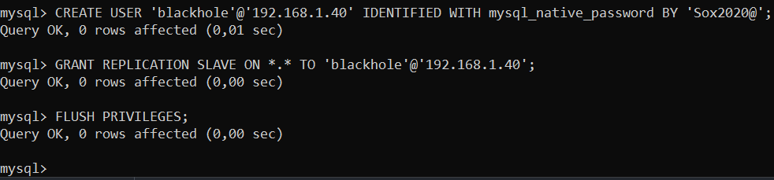
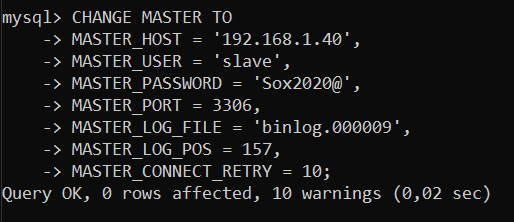

# Configuració d'un sistema de rèplica amb Blackhole

Preparem 1 maquina mes apart de les del apartat anterior amb el Percona instalat i IPs fixa

## CONFIGURACIÓ MASTER

Crearem l'usuari "blackhole"

`CREATE USER 'blackhole'@'IP-BLACKHOLE' IDENTIFIED WITH mysql_native_password BY '<pwd>';`

I li assigem permisos de replicació

`GRANT REPLICATION SLAVE ON *.* TO 'blackhole'@'IP-BLACKHOLE';`



Comprovem la posicio i quin en binlog esta el Master

`SHOW MASTER STATUS;`


## CONFIGURACIÓ BLACKHOLE

Modifiquem el server_id i declarem els parametres `default_storage_engine` i `default_tmp_storage_engine` en el my.cnf


Modifiquem el auto.cnf


Reiniciem el servei de Mysql


Ara crearem l'usuari "slave"

`CREATE USER 'slave'@'IP-SLAVE' IDENTIFIED WITH mysql_native_password BY '<pwd>';`

I li assigem permisos de replicació

`GRANT REPLICATION SLAVE ON *.* TO 'slave'@'IP-SLAVE';`


Canviarem el Master de la maquina slave

```
CHANGE MASTER TO
-> MASTER_HOST = '<ip-servidor-master>',
-> MASTER_USER = 'blackhole',
-> MASTER_PASSWORD = '<pwd>',
-> MASTER_PORT = 3306,
-> MASTER_LOG_FILE = '<valor trobat anteriorment>',
-> MASTER_LOG_POS = <valor trobat anteriorment>,
-> MASTER_CONNECT_RETRY = 10;
```


I iniciem l'slave

`START SLAVE;`


Executant la seguent comanda, hauriem de trobar el seguent misatge, per asegurarnos de que tot ha sortit bé

`SHOW SLAVE STATUS\G;`


FALTA HACER EL BLACKHOLE EN CADA TABLA

## CONFIGURACIÓ SLAVE

Del pas anterior ens haurem de quedar amb els parametres `Master_Log_File` i `Read_Master_Log_Pos`

Canviarem el Master de la maquina slave

```
CHANGE MASTER TO
-> MASTER_HOST = '<ip-servidor-blackhole>',
-> MASTER_USER = 'slave',
-> MASTER_PASSWORD = '<pwd>',
-> MASTER_PORT = 3306,
-> MASTER_LOG_FILE = '<Master_Log_File(pas anterior)>',
-> MASTER_LOG_POS = <Read_Master_Log_Pos(pas anterior)>,
-> MASTER_CONNECT_RETRY = 10;
```



I iniciem l'slave

`START SLAVE;`


Executant la seguent comanda, hauriem de trobar el seguent misatge, per asegurarnos de que tot ha sortit bé

`SHOW SLAVE STATUS\G;`


Ara crearem una taula en el Master dins de sakila i li afegirem dades, ara en el blackhole no hauriem de veure cap dada, pero en l'slave si

```
CREATE TABLE blackhole (prova INT);

INSERT INTO blackhole VALUES(10);
```


Mirem les dades que te la taula al blackhole

`SELECT * FROM blackhole;`


Mirem les dades que te la taula a l'slave

`SELECT * FROM blackhole;`


