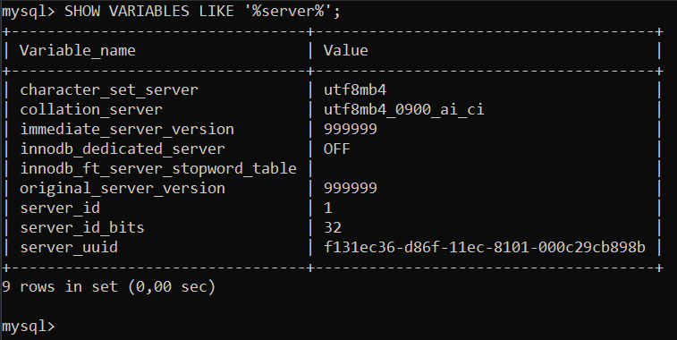
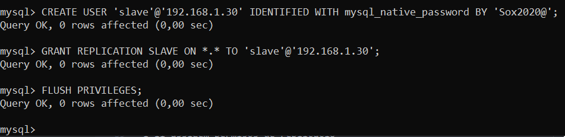
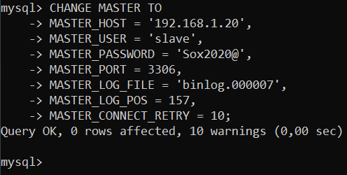

# Configuració d'un sistema de rèplica

Preparem 2 maquines (master i slave) amb el Percona instalat i IPs fixes

Per canviar la IP executarem el seguent

`nmtui`

I se'ns obrira un "entorn grafic"

Fem enter


Seleccionem la connexió


Anem a "Automático" dins l'apartat de IPv4


I seleccionem "Manual"


Afegim la IP, i anem a "Aceptar"


Anem a "Atras"


I anem a "Salir"


Per aplicar els canvis farem el seguent

`ifdown <nom tarjeta xarxa>`

`ifup <nom tarjeta xarxa>`


I executem `nmcli` per verificar que funciona


I farem el mateix proces a la maquina "Slave"

## CONFIGURACIÓ MASTER

Comprovar el "server-id" esta en 1



Farem un FLUSH dels LOGS

`mysql> FLUSH LOGS;`


Crearem un backup de la BBDD sakila (importada previament)

`mysqldump --user=root --password=<pwd> --master-data=2 sakila > /<path on es fará el backup>/backup.sql`


Ara mirarem els valors de "MASTER_LOG_FILE" i "MASTER_LOG_POS" dins del backup

`nano /<pathBackup>`

Farem Ctrl + W i buscarem "CHANGE MASTER TO"

I segudament trobarem els valors de "MASTER_LOG_FILE" i "MASTER_LOG_POS"


Ara crearem l'usuari "slave" a la maquina master

`CREATE USER 'slave'@'IP-SLAVE' IDENTIFIED WITH mysql_native_password BY '<pwd>';`

I li assigem permisos de replicació

`GRANT REPLICATION SLAVE ON *.* TO 'slave'@'IP-SLAVE';`



## CONFIGURACIÓ SLAVE

Parem el servei de Mysql


Anirem al my.cnf i deshabilitarem el binlog i assignarem un server-id diferent al del master

Per deshabilitar el binlog descomentarem el parametre "disable_log_bin"

I per modificar el server_id, afegim el parametre i li assignem el numero que volguem


Iniciem el servei de Mysql


Comprovem els canvis

`SHOW VARIABLES LIKE '%log_bin%';`


`SHOW VARIABLES LIKE '%server_id%';`


[OPCIONAL]Ara anirem al seguent archiu

`/var/lib/mysql/auto.cnf`

I el modificarem, ja que si esten en un entorn virtual, i hem duplicat maquines tindrem IDs repetits


Ara canviarem el Master de la maquina slave

```
CHANGE MASTER TO
-> MASTER_HOST = '<ip-servidor-master>',
-> MASTER_USER = 'slave',
-> MASTER_PASSWORD = '<pwd>',
-> MASTER_PORT = 3306,
-> MASTER_LOG_FILE = '<valor trobat anteriorment>',
-> MASTER_LOG_POS = <valor trobat anteriorment>,
-> MASTER_CONNECT_RETRY = 10;
```



I iniciem l'slave

`START SLAVE;`


Executant la seguent comanda, hauriem de trobar el seguent misatge, per asegurarnos de que tot ha sortit bé

`SHOW SLAVE STATUS\G;`


Ara crearem una taula en el Master dins de sakila, i hauriem de veure aquesta taula a l'slave´

```
CREATE TABLE slave (
    prova INT
);
```


Mirem quines taules te sakila a l'slave

`SHOW TABLES sakila;`


