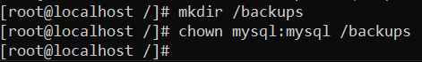

# REALITZAR UN BACKUP I RESTAURAR-LO

Instalem el Percona Xtrabackup
```
wget https://www.percona.com/downloads/XtraBackup/Percona-XtraBackup-8.0.4/binary/redhat/7/x86_64/percona-xtrabackup-80-8.0.4-1.el7.x86_64.rpm
```


`yum update`

`yum localinstall percona-xtrabackup-80-8.0.4-1.el7.x86_64.rpm`


Creem la carpeta `/backups` i li donem permisos



Creem el backup

`xtrabackup --backup --datadir=/var/lib/mysql/ --target-dir=/<target-path>`


