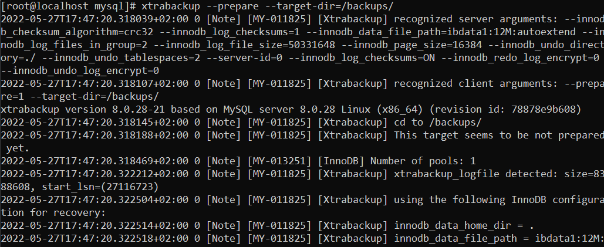
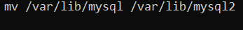

# REALITZAR UN BACKUP I RESTAURAR-LO

Instalem el Percona Xtrabackup

`yum install percona-xtrabackup-80`

Creem la carpeta `/backups` i li donem permisos

Creem el backup

`xtrabackup --backup --datadir=/var/lib/mysql/ --target-dir=/<target-path> --user=<usuari> --password=<password>`

Preparem el backup

`xtrabackup --prepare --target-dir=/<targetBackup>/`

Parem el servei de mysql

Ara renombrem la carpeta `/var/lib/mysql/`

I restaurarem el backup que acabem de crear

`rsync -avrP /<pathBackup>/* /<pathDesti>`

canviem els permisos dels fitxers que ha creat el xtrabackup a mysql

I aixequem el servei de mysql

